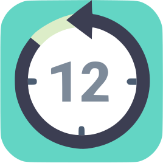

# MyCountDownTimer

  

    

    

    

     
        
MyCountDownTimer app for Linux, to control your device power managment when timer is finished!
 
    <h1 id="headAllows" class="title-about title">The app allows to:</h1>
    <ul class="ul-about">
        <li class="li-about">Shutdown.</li>
        <li class="li-about">Reboot.</li>
        <li class="li-about">Sleep.</li>
        <li class="li-about">Run a command.</li>
    </ul>
    
In the settings you can set timer on the time as you need or set delay.
          You can also choice, to show the modal window before you action or not, and change his position on the
        screen prior to show. Add app to auotorun. Run command. Keep app always on top.
         
         

